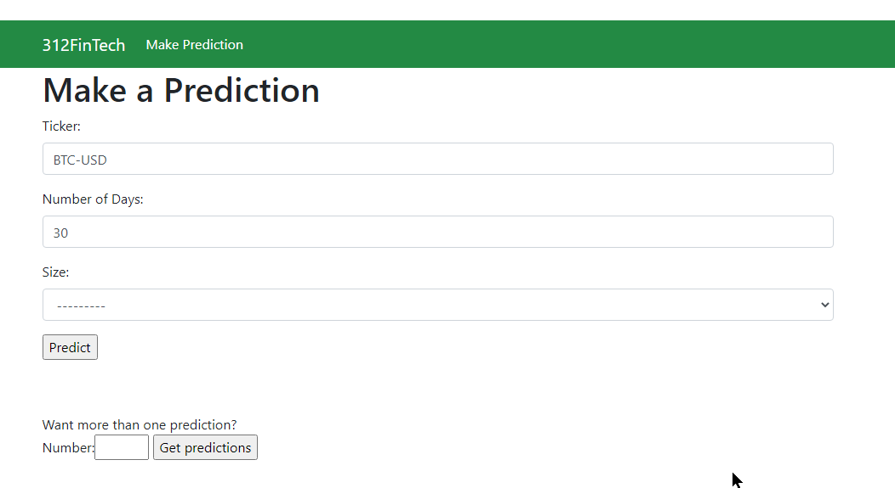

# Fintech-Forecast-App

[312 Main Website](https://megalodon-harpsichord-6cj7.squarespace.com/)
**Password protected in this stage of dev.*

A [Kivy](https://kivy.org/#home) app that uses ML/DL to forecast input ticker symbols and returns a chart of the forecast. Kivy can be deployed on Android, iOS, MacOS, Windows, & Linux OS's.

UI Concept


Mobile and Desktop Beta v1.0

 

BTC Forecast Using FB Prophet


Web App Beta v1.0



# Plan


## Install Guide
To [install Anaconda](https://www.anaconda.com/products/individual) on linux:
```
wget https://repo.anaconda.com/archive/Anaconda3-2021.11-Linux-x86_64.sh
bash Anaconda3-2021.11-Linux-x86_64.sh
```
Feel free to use [mamba](https://anaconda.org/conda-forge/mamba) instead of conda.
```
conda install mamba -n base -c conda-forge
```
### Full Install
If you are using a Linux system make sure you have `gcc`, `g++`, `build-essential`, `python-dev`, and `python3-dev` installed using a package manager or other means.  
```
conda activate base
conda create --name forecastappenv python=3.8.8 -y
conda activate forecastappenv
conda install kivy -c conda-forge -y
yes | pip install yfinance 
conda install -c conda-forge gcc -y
conda install -c plotly plotly -y
conda install -c conda-forge prophet -y
conda install -c anaconda django -y
conda install -c conda-forge djangorestframework -y
yes | pip install django-widget-tweaks
conda install -c conda-forge python-dotenv -y
conda install -c conda-forge jupyterlab -y
```
If you get and error for the `install gcc` use these commands then:
```
conda activate base
conda create --name forecastappenv python=3.8.8 -y
conda activate forecastappenv
conda install kivy -c conda-forge -y
yes | pip install yfinance numpy matplotlib pandas
pip install pystan==2.19.1.1 
conda install -c plotly plotly -y
conda install -c conda-forge prophet -y
conda install -c anaconda django -y
conda install -c conda-forge djangorestframework -y
yes | pip install django-widget-tweaks
conda install -c conda-forge python-dotenv -y
conda install -c conda-forge jupyterlab -y
```
### Kivy Install
```
conda activate base
conda create --name forecastappenv python=3.8.8 -y
conda activate forecastappenv
conda install -c anaconda ipykernel -y
ipython kernel install --user --name=forecastappenv
conda install kivy -c conda-forge -y
```
Run `main.py` in repo dir:
```
python main.py
```
To run Kivy demo app:
```
python ~/anaconda3/envs/forecastappenv/share/kivy-examples/demo/showcase/main.py
```
*Use this command to find the file if you can't locate it on your local machine:
(if using gitbash, try this `/c/ProgramData/Anaconda3/envs/forecastappenv/share/kivy-examples/demo/showcase/main.py` path instead)
```
sudo find / -type d -name '*kivy-examples*'
```
#### To Do Kivy
- [ ] Debug entering tickers consecutively
- [ ] Build second screen
    - [x] Use requests to connect with DRF api
        - [x] Decode encode byte code of Ezekial images
            - [ ] Make more efficient.
        - [x] Display Ezekial images to user

## Ezekial Pack (FB Prophet)
### Installation
If you are using a Linux system make sure you have `gcc`, `g++`, `build-essential`, `python-dev`, and `python3-dev` installed using a package manager or other means.  
```
conda activate base
conda create --name forecastappenv python=3.8.8 -y
conda activate forecastappenv
yes | pip install yfinance 
conda install -c conda-forge gcc -y
conda install -c plotly plotly -y
conda install -c conda-forge prophet -y
conda install -c anaconda django -y
conda install -c conda-forge jupyterlab -y
conda install -c conda-forge djangorestframework -y
yes | pip install django-widget-tweaks
conda install -c conda-forge python-dotenv -y
conda install -c conda-forge jupyterlab -y
```
```
mamba activate base
mamba create --name forecastappenv python=3.8.8 -y
conda activate forecastappenv
yes | pip install yfinance 
mamnda install -c conda-forge gcc -y
mamba install -c plotly plotly -y
mamba install -c conda-forge prophet -y
mamba install -c anaconda django -y
mamba install -c conda-forge jupyterlab -y
mamba install -c conda-forge djangorestframework -y
yes | pip install django-widget-tweaks
mamba install -c conda-forge python-dotenv -y
mamba install -c conda-forge jupyterlab -y
```

### Methods [(see `yahooprophet.py`)](ezekial/yahooprophet.py)
```
class YahooProphet:
    """Class that accepts a yahoo finance `yf_ticker`, `start_date` (yyyy-dd-mm), `forecast_ahead`
    Used with `forecast_df()`, `plot()`, `plotly_plot()`, & `forecast_all()` methods. For more info on FB Prophet visit.
    https://facebook.github.io/prophet/docs/quick_start.html#python-api"""
```
```
def forecast_all(self):
    """Returns a Facebook Prophet dataframe and forecast charts."""
```
```
def forecast_df(self):
    """Returns a Facebook Prophet dataframe."""
```
```
def plot(self):
    """Returns 4 charts on forecast of input pandas series."""
```
```
def plotly_plot(self):
    """Returns plotly plot of forecasted pandas series."""
```
## Django REST API Endpoints
[To be used with 312Server.](https://medium.com/swlh/build-your-first-rest-api-with-django-rest-framework-e394e39a482c)

### To Do
- [ ] Update API by byte encoding images ouput by Ezekial
- [ ] Merge necessary portions of `djanog-jt` branch (reproducing instuctions with code blocks preffered)

The Djanog File structure should look similar to the follow tree, after following this section of the `README.md`:
```
.
├── db.sqlite3
├── manage.py
├── myapi
│   ├── admin.py
│   ├── apps.py
│   ├── __init__.py
│   ├── migrations
│   │   ├── 0001_initial.py
│   │   ├── 0002_auto_20220321_0441.py
│   │   ├── __init__.py
│   │   └── __pycache__
│   │       ├── 0001_initial.cpython-38.pyc
│   │       ├── 0002_auto_20220321_0441.cpython-38.pyc
│   │       └── __init__.cpython-38.pyc
│   ├── models.py
│   ├── __pycache__
│   │   ├── admin.cpython-38.pyc
│   │   ├── apps.cpython-38.pyc
│   │   ├── __init__.cpython-38.pyc
│   │   ├── models.cpython-38.pyc
│   │   ├── serializers.cpython-38.pyc
│   │   ├── urls.cpython-38.pyc
│   │   └── views.cpython-38.pyc
│   ├── serializers.py
│   ├── tests.py
│   ├── urls.py
│   └── views.py
└── mysite
    ├── asgi.py
    ├── __init__.py
    ├── __pycache__
    │   ├── __init__.cpython-38.pyc
    │   ├── settings.cpython-38.pyc
    │   ├── urls.cpython-38.pyc
    │   └── wsgi.cpython-38.pyc
    ├── settings.py
    ├── urls.py
    └── wsgi.py
```

Project Start Commands:
```
django-admin startproject mysite
cd mysite/
python manage.py startapp myapi
```
- Add ip address as a string to `ALLOWED_HOSTS = ['']` 
- Add `'myapi.apps.MyapiConfig',` and `'rest_framework',` to `INSTALLED_APPS = [...]` :
```
nano mysite/settings.py
```
Use `ctrl + x` to close nano, `y` to save
Setup SQLite DB:
```
python manage.py migrate
```
Create superUser to login into admin portal:
```
python manage.py createsuperuser
```
Launch the Django server to test the setup config so far:
```
python manage.py runserver 0.0.0.0:REPLACE_WITH_PORT_NUMBER
```
In your browser go to `http://YOUR_IP_ADDRESS:PORT_NUMBER_FROM_ABOVE/admin/` and enter in the user name and password credentials you entered previously. (use `localhost` if you are not using your ip and port forwarding)

Use `ctrl + c` (`cmd + .` on macOS) to stop the running Django server

Create a class to store the data in `myapi/models.py`:
```
nano myapi/models.py
```
```
# Create your models here.
class ForecastProphet(models.Model):
    # Will want ticker, date, and chart attribute aka column
    # The chart attribute will be a byte encoded string of the
    # image files saved from Ezekial.
    # Be sure update the fields in ForecastProphetSerializer
    # This is for creating SQLite DB

    ticker = models.CharField(max_length=10)
    encoded_string = models.TextField() 

    # more attributes here

    def __str__(self):
        # The returned attribute will be what shows up as the entries title in the
        # admin portial on the django site
        return self.ticker
```
Tell Django to migrate the changes:
```
python manage.py makemigrations
python manage.py migrate
```
Open `myapi/admin.py` to add the `ForecastProphet` Class:
```
nano myapi/admin.py
```
```
from .models import ForecastProphet

admin.site.register(ForecastProphet)
```
Launch the Django server to test the setup config so far:
```
python manage.py runserver 0.0.0.0:REPLACE_WITH_PORT_NUMBER/admin
```
You should see the `ForecastProphet` Class now:

Make one entry of dummy data to test the api by clicking on the ***Add*** button next to **Forecast prophets**:
```
BTC-USD
ASFWEFWEFWAFASDFWEFAEWF23F23F23FEAFEW
```
The entry will show up like this now:


Create a serializer in `myapi/serializers.py` :
```
touch myapi/serializers.py
nano myapi/serializers.py
```
```
# serializers.py
from rest_framework import serializers

from .models import ForecastProphet

class ForecastProphetSerializer(serializers.HyperlinkedModelSerializer):
    class Meta:
        model = ForecastProphet
        fields = ('id', 'ticker', 'encoded_string')
```
- Query the database for all `Forecast prophets` entries
- Pass that database queryset into the serializer we just created, so that it gets converted into JSON and rendered
```
nano myapi/views.py
```
```
# views.py
from django.shortcuts import render
from rest_framework import viewsets
from .serializers import ForecastProphetSerializer
from .models import ForecastProphet

class ForecastProphetViewSet(viewsets.ModelViewSet):
    queryset = ForecastProphet.objects.all().order_by('ticker')
    serializer_class = ForecastProphetSerializer
```

Update the following lines in `mysite/urls.py` :
```
nano mysite/urls.py
```
```
from django.contrib import admin
from django.urls import path, include

urlpatterns = [
    path('admin/', admin.site.urls),
    path('', include('myapi.urls')),
]
```
Create `myapi/urls.py` that was pointed to in the above code:
```
touch myapi/urls.py
nano myapi/urls.py
```
```
# myapi/urls.py
from django.urls import include, path
from rest_framework import routers
from . import views

router = routers.DefaultRouter()
router.register(r'ticker', views.ForecastProphetViewSet)

# Wire up our API using automatic URL routing.
# Additionally, we include login URLs for the browsable API.
urlpatterns = [
    path('', include(router.urls)),
    path('api-auth/', include('rest_framework.urls', namespace='rest_framework'))
]
```
Start the django server so see if the DRF is setup correctly:
```
python manage.py runserver 0.0.0.0:REPLACE_WITH_PORT_NUMBER
```
In your browser go to `http://YOUR_IP_ADDRESS:PORT_NUMBER_FROM_ABOVE` it should look similiar to this:


If you click on the URL it will show you the JSON that is returned:

We can access individual instances by appending some index int like this to the url:
```
http://YOUR_IP_ADDRESS:PORT_NUMBER_FROM_ABOVE/ds/1
```
**This is helpful for when we use `.delete()` with `requests`*

---

## [Creating Package for Android](https://kivy.org/doc/stable/guide/packaging-android.html)

Edit this line in the `buildozer.spec` file.
```
p4a.branch = develop
```
Use the Adroid Device Bridge if needed (i.e. WSL):
(USB Debugging must be enabled in devoloper options by tapping the build number 5 times in the settings menu)
```
/mnt/c/Users/mchar/Downloads/platform-tools_r33.0.0-windows/platform-tools/adb.exe devices
````
* can add adb to environmatal variables (use `sudo apt install adb` for linux)
Compile the app using:
(this takes a long time!)
```
buildozer -v android deploy run
```
or
```
buildozer android debug deploy run
```
If it compiles successfully and doesn't upload to your device start a local host server by:
```
buildozer serve
```
It will tell you a port number and you can access it your browser by doing a `localhost:THE_PORT_NUMBER_HERE`, then download the `.apk` file and transfer it to your device.

Or you can just access it from the project dir where it should be located after successfully compiling.

## [Creating Package for Windows](https://kivy.org/doc/stable/guide/packaging-windows.html)
### Installation
```
conda activate forecastappenv
conda install -c conda-forge pyinstaller -y
```
# Future Features / Models / To Do (Please add to this)

- [ ] Multivariate Model
    - [ ] AutoML (Kats)?
    - [ ] Save pickle file for model and use for forecast, as to not retrain the model on each api call
- [ ] Create documents showcasing metrics of the app
    - [ ] Metrics showing how often the forecast was correct on new data (NOT backtesting) both in terms of the second derivative (increase or decrease) and the distance from the actual change in price
- [ ] Rebuild Front end for each platform (i.e. Android studio [might be able to get to work for iOS too])
- [ ] Website and Dashboard
    - [ ] Continue with Website and web app dev
    - [ ] Django server and JS
- [ ] YouTube video (short), that explains the app in simplicity and brevity
    - [ ] Either use Adobe and or open source tools like [Shotcut](https://shotcut.org/download/) & [GIMP](https://www.gimp.org/downloads/)
- [ ] Get user feedback / data
- [ ] Create a written Business Proposal and present to potential investors
- [ ] Scale up if the user usage and count increases greatly, but either investing in additional server hardware, Cloud accounts, or time to figure out how to maximize free cloud accounts / api's
